Flutter Audio Waveforms is an UI library to add audio waveforms to your apps easily ,while also providing customization options.

# Features

You can use the following available waveform types.

* Polygon
* Rectangle
* Squiggly

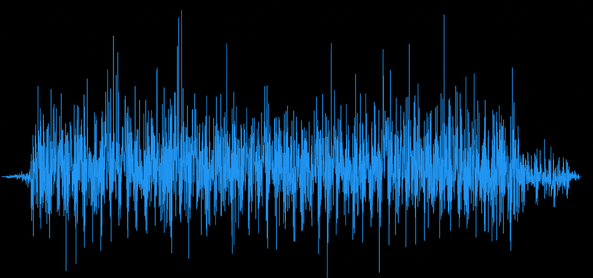
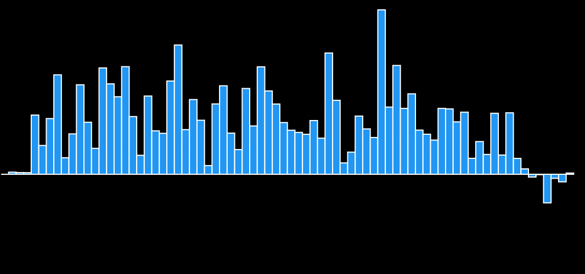
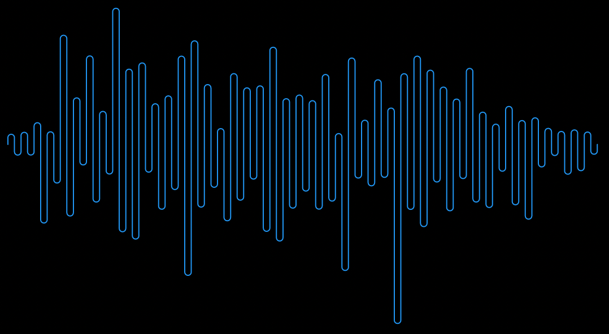

<br>

Need to add some gradient to your waveform? Say no more! You get it along with other customization options.

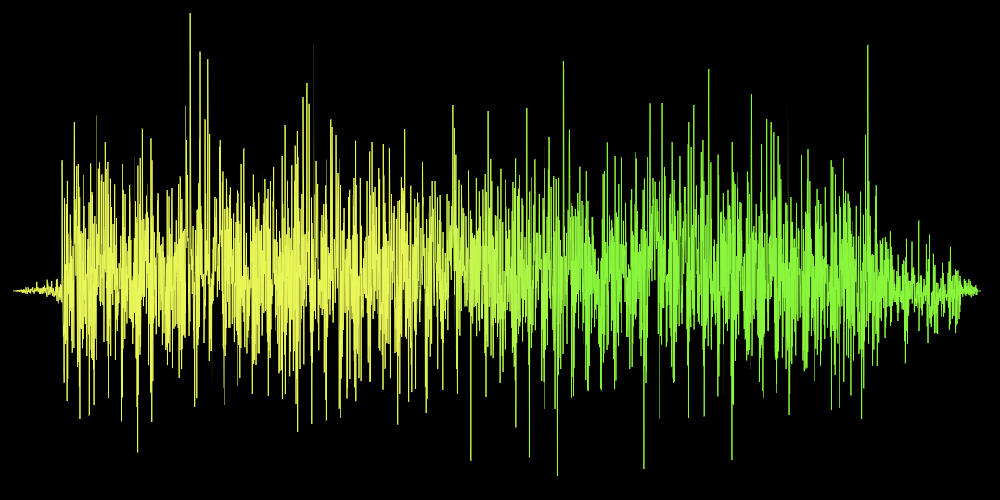
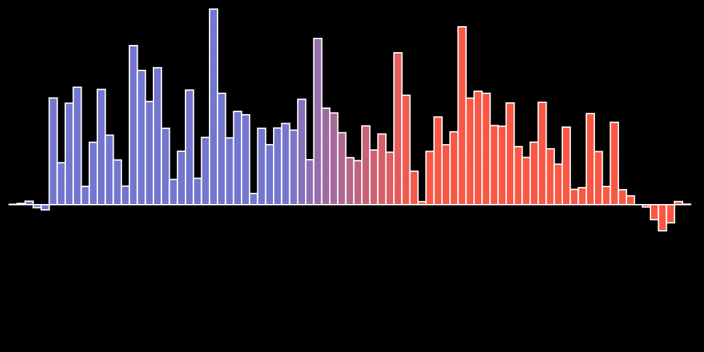
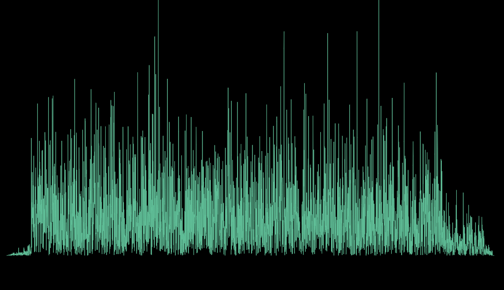
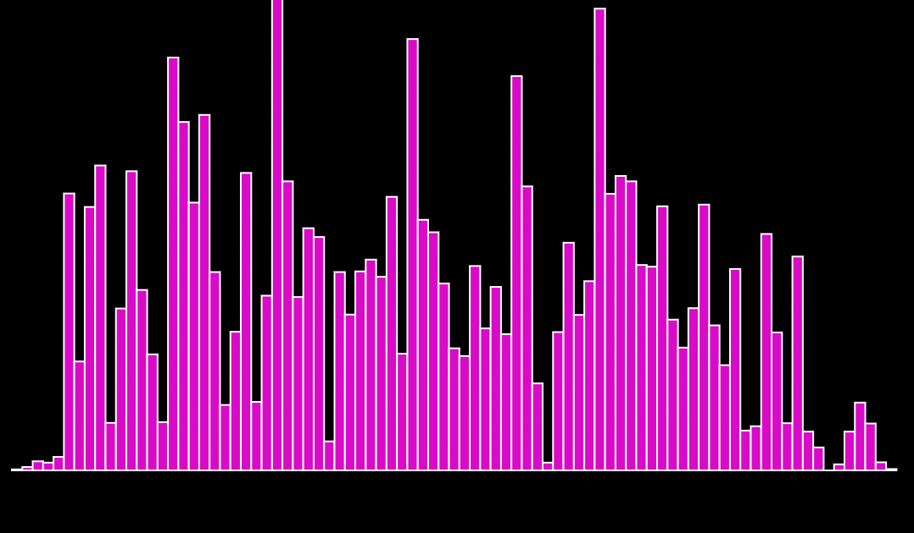
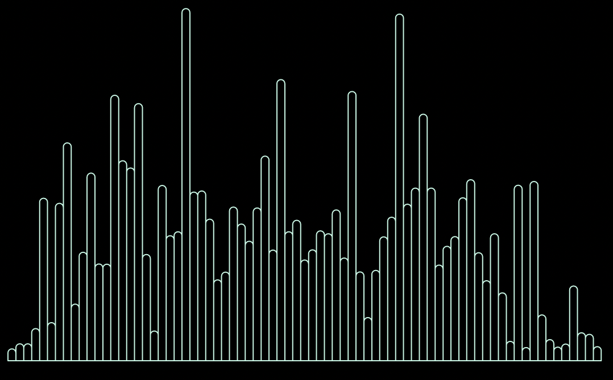

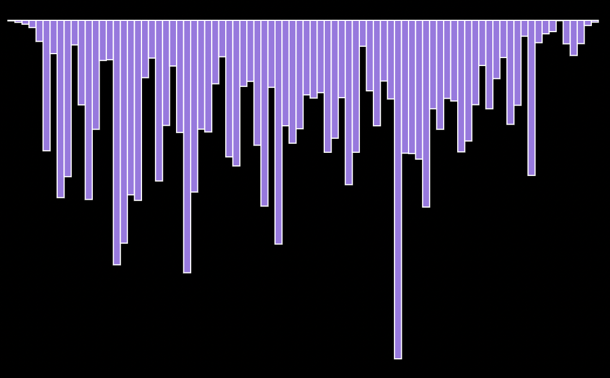
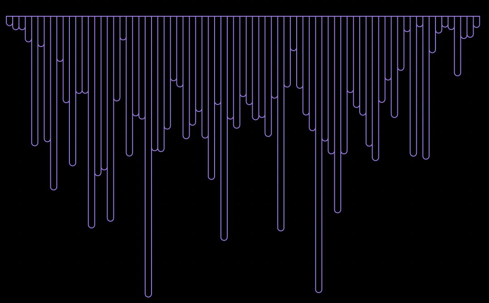
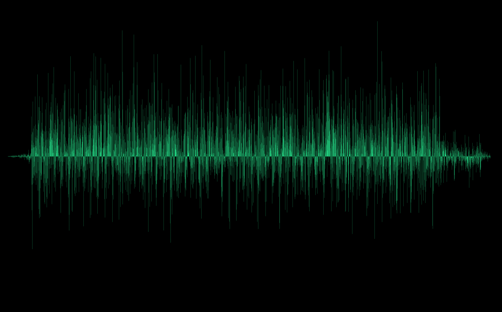
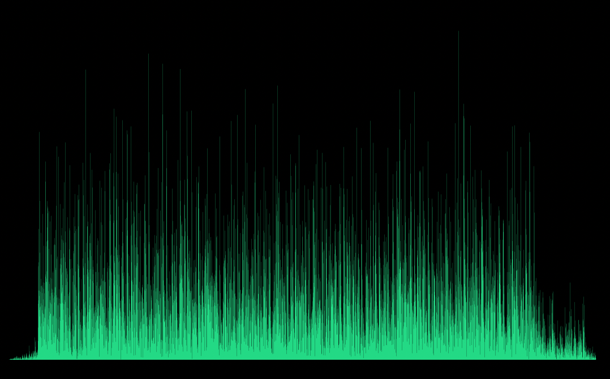
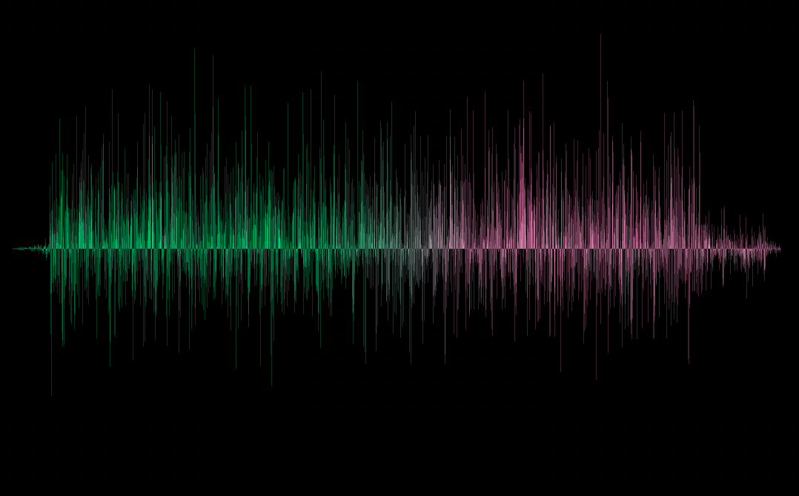
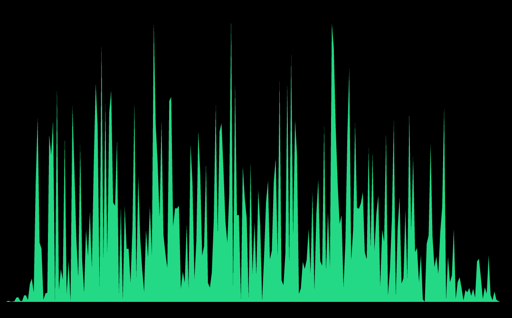

<br>

Want an active track for your audio out of the box?
You get that too!

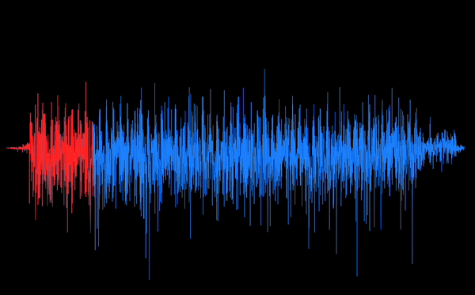
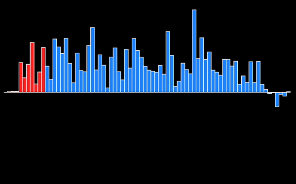
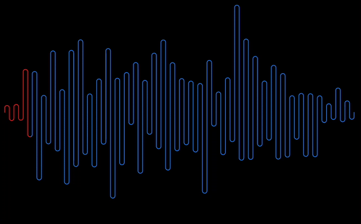


# Getting started

The package gives you the ability to add waveforms and customize them.
It's mostly like a UI library for waveforms with an additional ability to show active track for playing audio.

So it relies on you to provide the necessary audio data which it needs to draw the waveform.
The data we need is basically a list of points/samples that represents that audio.

You can use this [waveform generator](https://github.com/bbc/audiowaveform) to get the [json audio data](https://gist.github.com/rutvik110/946ee0f3036a18da1297e57c547ae241) from an audio file. The generated data needs to be processed following some rules which are necessary to get the waveforms drawn properly. To process the data use [this parser](https://gist.github.com/rutvik110/31a588244d288e89368e8704c1437d34).

Once you have the processed data points list then you can just pass it down to any of the waveforms available and get started using them.


# Usage

Usage of all waveforms available is the same with only exception of having more/less customization options for different waveforms.


```dart
 PolygonWaveform( 
   maxDuration: maxDuration,
   elapsedDuration: elapsedDuration,
   samples: [],
   height: height,
   width: width, 
 )
 ```

```dart
 RectangleWaveform(
   maxDuration: maxDuration,
   elapsedDuration: elapsedDuration,
   samples: [],
   height: height,
   width: width,
 )
```

```dart
 SquigglyWaveform(
   maxDuration: maxDuration,
   elapsedDuration: elapsedDuration,
   samples: [],
   height: height,
   width: width,
 )
```

> Find detailed [example here](https://github.com/rutvik110/flutter_audio_waveforms/blob/master/example/lib/readme_example.dart).

# Properties

**maxDuration**:

Maximum duration of the audio.

**elapsedDuration**:

Elapsed Duration of the audio.

**samples**:

List of the audio data samples.
> Check the **Getting Started** section on how to generate this.

**height** :

Waveform height.

**width** :

Waveform width.


## Customization Options 

**inactiveColor** :

Color of the inactive waveform.

**activeColor** :

Color of the active waveform.

**inactiveGradient** :

Gradient of the inactive waveform.

**activeGradient** :

Gradient of the active waveform.

**absolute** :

Waveform drawn is one sided either above x-axis or below it depending on what `invert` is set to.

Defaults to `false`.

**invert** :

Flips/inverts the waveform upside down.

Defaults to `false`.

**borderWidth** : 

Width of the border around waveform. 

Available only for `RectangleWaveform`.

**strokeWidth** :

Waveform stroke width.

Available only for `SquigglyWaveform`.

**inactiveBorderColor**:

Border color for inactive waveform.

Available only for `RectangleWaveform`.

**activeBorderColor**:

Border color for active waveform.

Available only for `RectangleWaveform`.

**showActiveWaveform**:

Whether to show active waveform or not.

Defaults to `true`.


### **More customization options coming soon!**

# Contributing Guide

* Feature request :<br> If you have any new feature in mind from which this package can benefit then please let me know by filing an [issue here](https://github.com/rutvik110/flutter_audio_waveforms/issues).

* Improvements :<br> Got any suggestions on improving the package, anything from API to performance then let me know by filing the [issue here](https://github.com/rutvik110/flutter_audio_waveforms/issues).

* Bugs: <br> If you happen to come across anything that shoudln't be happening then please file an [issue here](https://github.com/rutvik110/flutter_audio_waveforms/issues) describing what the bug is and how to reproduce it with attached code and preview if possible.

# Additional information

What started as a challenge out of curiosity, is now a package that I hope will be helpful to many of you and it was actually really fun building it.

Learned some good stuff while working on it and I hope to make it much more going forward.

If this package helped you then I would appreciate a like here which would be enough for me to keep continue working on it and if it really really helped you then feel free to drop by and [say hi](https://twitter.com/TakRutvik).


